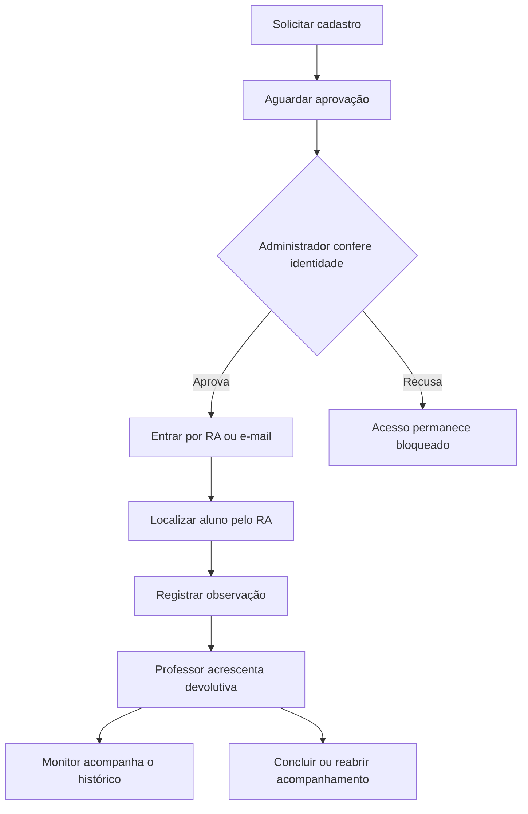
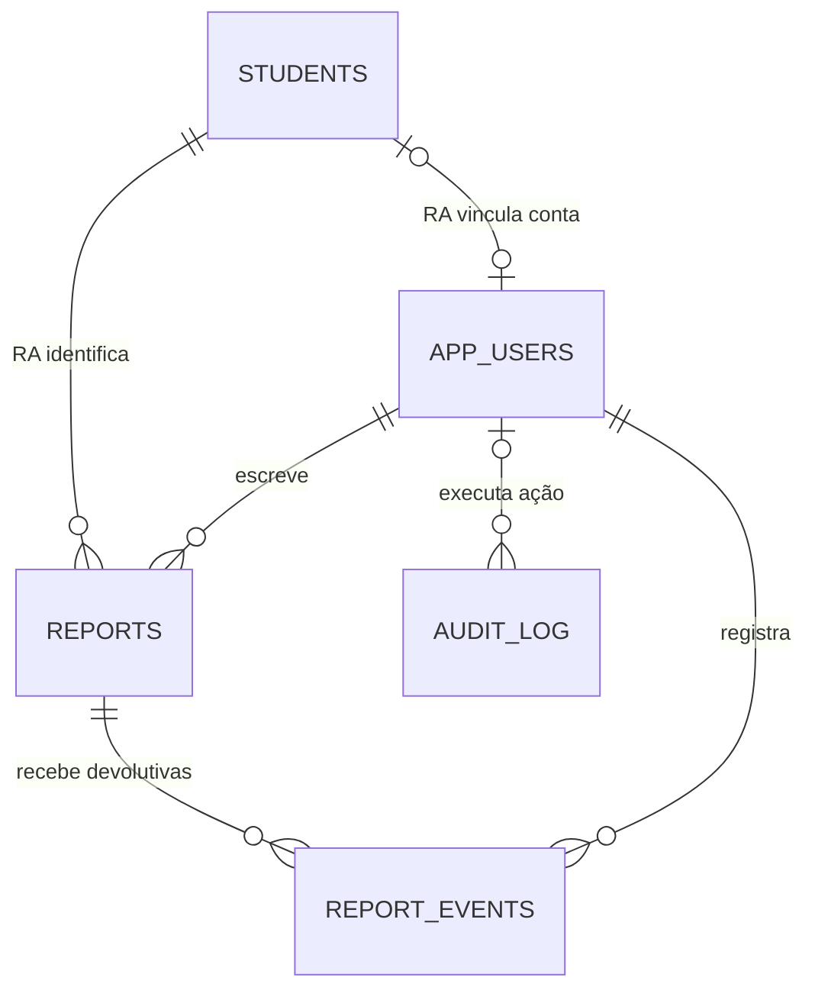

# Arquitetura e modelo de dados

## Objetivo

Centralizar o acompanhamento pedagógico e a comunicação entre monitores e professores, mantendo o aluno identificado pelo RA. Versão 2.0, revisão de 19 de setembro de 2026.

## Fluxo e limites de acesso

O navegador faz requisições JSON para a mesma origem. O Express autentica o cookie, consulta o usuário ativo no banco, verifica o perfil, valida os dados e executa consultas parametrizadas. Transações usam a mesma conexão do pool do início ao fim.

A aplicação é de uma escola. Não há multi-inquilino nem atribuição de turmas a professores. Monitores localizam alunos ativos, mas só leem relatórios que eles próprios escreveram. Professores e administradores leem todos os registros da instalação.

## Modelo relacional

| Entidade | Identificador e relações | Conteúdo e regras |
| --- | --- | --- |
| `students` | `ra` PK; `id` UUID único legado | Nome, curso, semestre (1 a 20), turma, contatos opcionais, ativo, versão e datas |
| `app_users` | `id` UUID PK; e-mail único; `ra` FK opcional e único | Nome, hash da senha, perfil, ativo, aprovação, versões da sessão/cadastro e datas |
| `reports` | `id` UUID PK; `(student_id, student_ra)` FK composta; `author_id` FK | Observação de 10 a 2.000 caracteres, situação, versão, chave de reenvio e datas |
| `report_events` | UUID PK; FKs para relatório e autor | Devolutiva de 3 a 2.000 caracteres, situação e data; registros não sobrescritos pela API |
| `audit_log` | UUID PK; autor opcional | Ação, tipo/chave da entidade, metadados mínimos e data |
| `auth_attempts` | HMAC da chave de limite | Contagem e expiração de tentativas de autenticação, sem RA/e-mail/IP em texto aberto |
| `schema_migrations` | Nome de migração PK | Checksum SHA-256 e data de aplicação |

### Integridade do RA

RA é `VARCHAR(40)`. O sistema mantém zeros à esquerda, normaliza letras para maiúsculas e aceita ponto e hífen; não converte o campo para inteiro. A migração verifica colisões antes de normalizar.

A FK composta dos relatórios garante que o UUID legado e o RA se refiram ao mesmo aluno. `ON UPDATE CASCADE` propaga correções de RA para relatórios e contas. `ON DELETE RESTRICT` protege o histórico de exclusões acidentais. A interface inativa alunos, sem apagar registros.

Professores e administradores podem não possuir RA. Seus UUIDs e e-mails continuam identificando a conta. Contas antigas de monitor sem RA mantêm login por e-mail até o vínculo administrativo; cadastro novo de monitor exige RA.

### Concorrência e rastreabilidade

Alterações de alunos, contas e devolutivas enviam `version`. O servidor bloqueia a linha durante a transação, compara a versão e responde `409 VERSION_CONFLICT` se alguém alterou o registro antes. A transação inclui a alteração e a auditoria.

A observação original permanece preservada. Professor/administrador acrescenta `report_events` e muda o estado; reaberturas também ficam no histórico. Não há endpoint de exclusão de relatórios. A auditoria técnica guarda campos alterados e ações, sem copiar textos pedagógicos, contatos ou senhas. Ela não é um serviço externo imutável: administradores diretos do banco ainda podem modificá-la.

A chave `requestKey` de cada tentativa de envio é única por autor. Repetir a mesma chave e conteúdo retorna o relatório existente. Reutilizar a chave com conteúdo diferente retorna conflito. A chave fica apenas na memória da página.

## Migrações

`001_initial.sql` reproduz a estrutura anterior com `CREATE ... IF NOT EXISTS`. `002_ra_workflow.sql` migra a base existente. O executor aplica ambas em uma transação com trava consultiva, verifica checksum e não reaplica migrações registradas. Nunca edite uma migração que já foi aplicada: acrescente uma terceira migração.

O trigger `reports_resolve_student` resolve o RA quando um cliente legado insere somente `student_id`. Isso mantém compatibilidade de escrita durante a atualização. As listas da API 2.0, porém, retornam objetos paginados; integrações antigas devem ser ajustadas.

## Desempenho

Foram removidos os limites fixos de 500 alunos e 1.000 relatórios enviados de uma vez. A API retorna 20 itens por página por padrão, com máximo de 100. A busca por nome no formulário retorna até dez sugestões e pede refinamento quando há mais.

Há índices para RA, aluno/data, autor/data, estado/data, alunos ativos/nome, aprovação de contas e eventos de relatório. A busca ampla por conteúdo ainda usa `ILIKE '%termo%'`; esse tipo de filtro pode exigir busca textual/trigramas quando a base crescer. As contagens totais e a paginação por offset também devem ser medidas com o volume real.

Frontend sem frameworks, imagens de fundo ou fontes externas. A versão 2.0 adiciona funções e aumenta o tamanho dos arquivos estáticos em relação à anterior; a redução de tráfego está principalmente na paginação e no carregamento sob demanda. Não foi alegada uma melhoria percentual de latência sem teste de carga.
